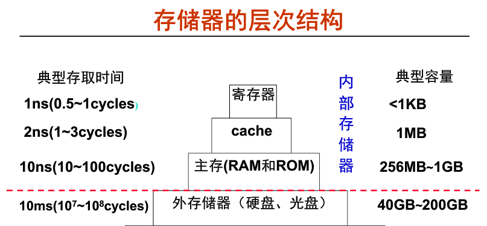

# Cache 的基本概念与工作原理

## 1. 背景知识

随着 CPU 技术的飞速发展，常用的处理器飞奔在越来越高的频率之上，从原来的几十 Mhz 到今天的几百 Mhz

## 2. 计算机的层次结构存储系统

计算机采取存储程序的工作方式，意味着在程序执行时所有的指令和数据都是从存储器中取出来执行的。存储器是计算机系统中的重要组成部分，相当于计算机的仓库，用来存放各类程序及其处理的数据。因此存储器的容量和性能应当随着处理器的速度和性能的提高而通过提高，以保持系统性能的平衡。然而在过去的 20 多年中，随着时间的推移，处理器和存储器在性能发展上的差异越来越大，存储器在容量尤其是访问延时方面的性能增长越来越跟不上处理器性能发展的需要。为了缩小存储器和处理器两者之间在性能方面的差距，通常在计算机内部采用层次化的存储器体系结构。

从上图可以看到，速度越快则容量越小、越靠近 CPU，

## 3. 为什么需要 Cache?

由于 CPU 和主存所使用的半导体器件工艺不同，两者速度上的差异导致快速的 CPU 等待慢速的存储器，为此需要想办法提高 CPU 访问主存的速度。除了提高 DRAM 芯片本身的速度和采用并行结构技术以外，加快 CPU 访存速度的主要方式之一是在 CPU 和主存之间增加高速缓冲器，也就是我们主角 Cache。

- 介绍程序访问的局部性

## 4. 基本概念
## 4. 工作原理
