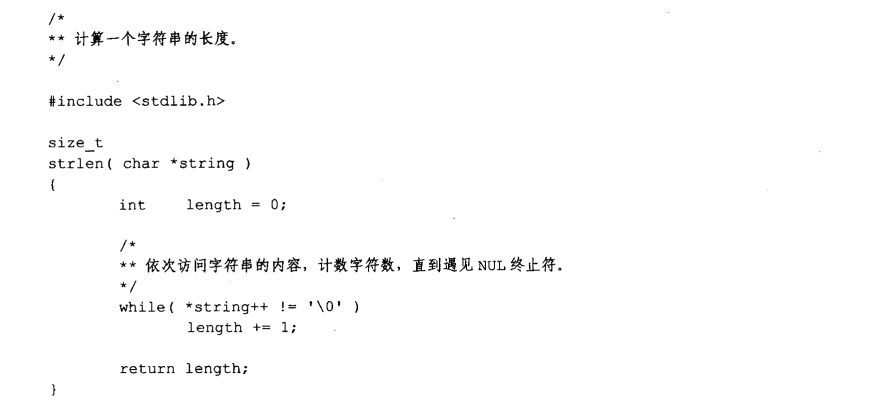
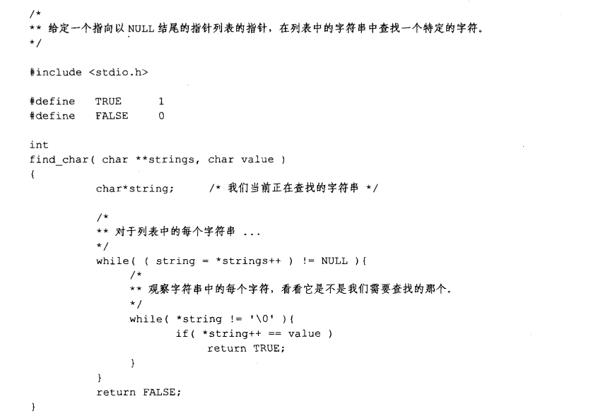
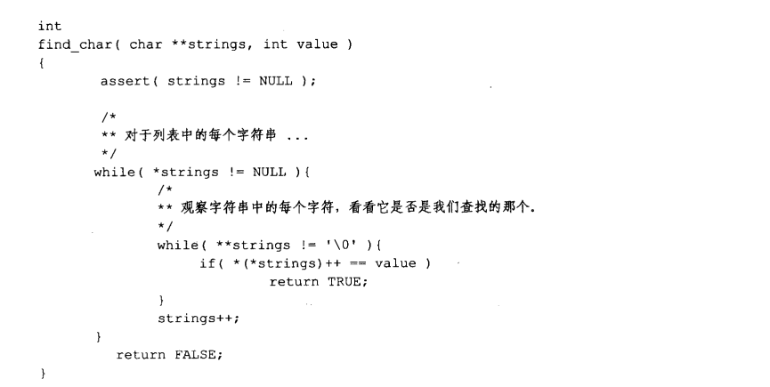

# 指针

## 内存和地址

变量的值存储于计算机的内存中，每个变量都占据着一个特定的位置。每个内存位置都由地址唯一确定并引用，就像是一条街道上的房子由他们的门牌号码标识一样。指针只是地址的另一个名字罢了。指针变量就是一个其值为另外一个内存地址的变量。

首先必须要非常明确的是：指针的实质就是个变量，它跟普通变量没有任何区别。指针完整的名字应该叫做指针变量，简称为指针。

指针的出现是为了实现间接访问，在汇编中都有间接访问，其实就是 CPU 寻址方式中的间接寻址。间接访问（CPU的间接访问）是C PU 设计时决定的，这个决定了汇编语言必须能够实现间接寻址，又决定了汇编之上的 C 语言也必须实现间接寻址。

间接寻址：意思就是不是通过一个立即数直接找到具体的数据，而是这个数据的地址被放在了一个寄存器中，我们先访问寄存器得到数据的地址，然后在通过得到的地址去访问所需要的数据。这里的寄存器在C语言中表现为指针变量，寄存器中的地址在 C 语言中表现为目标数据的地址，然后通过解引用指针变量中的地址来访问目标数据。原来 C 语言实现指针的机制后面是有硬件作为基础的，这才是本质。

高级语言中 C#，JAVA 等没有指针，也可以实现相关的功能，原因是语言本身帮我们封装了。

## 值和类型

不能简单地通过检查一个值地位来判断一个数值的类型。为了判断这个值的类型（以及它的值），必须观察程序中使用这个值的方式。

## 指针变量的内容

变量的值就是分配给这个变量的内存位置所存储的数值，即使是指针变量也不例外。

## 间接访问操作符

通过一个指针访问它所指向的地址的过程称为间接访问（indirection）或解引用指针（dereferencing the pointer）。这个用于执行间接访问的操作符是单目操作符 *。

指针变量的值就是一个数字。箭头显示了这个数字的值，但箭头记法并未改变它本身就是个数字的事实。指针并不存在内建的间接访问属性，所以除非表达式中存在间接访问操作符，否则你不能按箭头所示实际访问它所指向的位置。

## 未初始化和非法的指针

### 野指针概念

野指针就是指针指向的位置是不可知的（随机的，不正确的，没有明确限制的）

野指针很可能触发运行时段错误（sgmentation fault）。

因为指针变量在定义时如果未初始化，值也是随机的。指针变量的值其实就是别的变量的地址，所以意味着这个指针指向了一个地址是不确定的变量，这时候去解引用就是去访问这个地址不确定的变量，所以结果是不可知的。

### 如何避免野指针

野指针的错误来源就是指针定义了以后没有初始化，也没有赋值，没有明确指向一个可用的内存空间，然后就去解引用了。

避免野指针的方法：在指针的解引用之前，一定确保指针指向一个绝对可用的空间。

常规的做法是：

1.定义指针时，同时初始化为NULL.

2.在指针解引用之前，先去判断这个指针是不是NULL。

3.在指针使用完之后，将其赋值为NULL。

4.在指针使用之前，将其赋值绑定一个可用地址你空间。

这四点防止野指针的方案绝对可行，在实践中在中小型的程序中，自己的水平可以把握的时候，可以不必严格按照这个标准，但是在大型程序中，或者自己水平感觉不好把握时，需要严格按照这样的标准。

## NULL 指针

NULL 在 C/C++ 中定义为：

```c
#ifdef _cplusplus			// 定义这个符号就表示当前是C++环境
#define NULL 0	            // 在C++中NULL就是0
#else
#define NULL (void *)0		// 在C中NULL是强制类型转换为void *的0
#endif
```
在C语言中，int *p，可以用 p = (int *)0，但是不可以 p = 0；因为类型不相同。

所以 NULL 的实质就是 0，然后我们给指针赋初值为 NULL，其实就是让指针指向 0 地址处。为什么要指向0地质处呢？原因有两个：

1.第一个原因是 0 地址处作为一个特殊地址，我们认为指针指向 0 地址就表示指针没有被初始化，就表示为野指针。

2.第二个原因是 0 地址一般在操作系统中都是不可被访问的，如果 C 程序员不检查指针是否等于 NULL，就直接去解引用这个指针，那么就会触发段错误，这已经是最好的结果了。

一般判断指针是否是野指针就写成 if (NULL == p)，而不写成 if(p == NULL)，这样写如果将 == 写成了 = 编译器就会报错，程序员就会发现这个问题。

## 指针、间接访问和左值

指针变量可以作为坐值，并不是因为他们是指针，而是因为他们是变量。对指针变量进行间接访问表示我们应该访问指针所指向的位置。间接访问制定了一个特定的内存位置看这样我们把间接访问表达式当作左值使用。

## 指针、间接访问和变量

```c
*&a = 25; 
```

上面这一句的效果和 a = 25 是一样的，但是它涉及更多的操作。除非编译器知道你在干什么并丢弃额外的操作，否则它所产生的目标代码将会更大、更慢。更糟糕的是，这些额外的操作符会使源代码的可读性变差。基于这些原因，没人会故意使用像 *&a 这样的表达式。

## 指针常量

访问内存中某个特定的位置，通过强制类型转换将一个整数转化为指针类型。
```
*(int *)100 = 25;
```

## 指针的指针

假定有如下的声明：
```c
int a = 12;
int *b = &a;
int **c = &b;
```

上面的新面孔是最后一个表达式，让我们来对它进行分析。 * 操作符有从右向左的结核性，所以这个表达式相当于 `*(*c)`，我们从里向外逐层求值。`*c` 访问 c 所指向的位置，我们知道这是变量 b。第二个间接访问操作符访问这个位置所指向的地址，也就是变量 a。指针的指针并不难懂，只需要留心所有的箭头，如果表达式中出现了间接访问操作符，就随箭头访问它所指向的位置。

## 指针表达式

声明如下：
```c
char ch = 'a';
char *cp = &ch;
```

### &ch

| 表达式 | 右值           | 左值 |
| ------ | -------------- | ---- |
| &ch    | 变量 ch 的地址 | 非法 |

&ch 不能当作左值使用，因为当表达式 &ch 进行求值时，它的结果存在何处是未知的。这个表达式并没有标识任何机器内存的特定位置，所以它不是一个合法的左值。

### cp

| 表达式 | 右值           | 左值 |
| ------ | -------------- | ---- |
| cp    | cp 的值 | cp 所处的内存位置 |

### &cp

| 表达式 | 右值           | 左值 |
| ------ | -------------- | ---- |
| cp    | 指针变量的地址| 非法 |

这次所取得的是指针变量的地址，这个结果的类型是指向字符的指针的指针。同样，这个值得存储位置并未清晰定义，所以这个表达式不是一个合法的左值。

### `*cp`

| 表达式 | 右值           | 左值 |
| ------ | -------------- | ---- |
| *cp   | cp 指针指向变量的值 | cp 指针指向的地址 |

### `*cp + 1`

| 表达式 | 右值           | 左值 |
| ------ | -------------- | ---- |
| `*cp + 1`  | cp 指针指向变量的值加一 | 非法|

表达式的最终结果为字符 'b'，但是这个表达式的最终结果的存储位置并未清晰定义，所以它不是一个合法的左值。**优先级表格证实 + 的结果不能作为左值**。

### `*(cp + 1)`

| 表达式 | 右值           | 左值 |
| ------ | -------------- | ---- |
| `*(cp + 1)`   | cp 指针加一位置的值 | cp 指针加一位置本身|

这里需要学习很重要的一点。注意指针加法运算地结果是个右值，因为它的存储位置并未清晰定义。如果没有间接访问操作，这个表达式将不是一个合法的左值。然而，间接访问跟随指针访问一个特定地位置。这样，`*(cp + 1)`就可以用来当作左值使用，尽管 `cp+1` 本身并不是左值。间接访问操作符是少数几个其结果为左值地操作符之一。

### ++cp

| 表达式 | 右值           | 左值 |
| ------ | -------------- | ---- |
| ++cp  |cp 指针增值后的一份拷贝  | 非法|

我们增加了指针变量 cp 的值。表达式的结果是增值后的指针的一份拷贝，因为前缀 ++ 先增加它的操作数的值再返回这个结果。这份拷贝的存储位置并未清晰定义，所以它不是一个合法的左值。

### cp++

| 表达式 | 右值           | 左值 |
| ------ | -------------- | ---- |
| cp++  |cp 指针的一份拷贝  | 非法|

后缀++操作符同样增加 cp 的值，但是它先返回 cp 值得一份拷贝然后再增加 cp 得值。这样这个表达式的值就是 cp 原理指针的一份拷贝。

++cp 和 cp++ 这两个表达式的值都不是合法的左值。但是如果我们再表达式中增加了间接访问操作符，他们就可以成为合法的左值，如下面两个表达式：

### `*++cp`

| 表达式 | 右值           | 左值 |
| ------ | -------------- | ---- |
| `*++cp`|cp 指针指向地址后面那个地址上的值 | cp 指针指向的地址后面那个地址的位置本身|

### `*cp++`

| 表达式 | 右值           | 左值 |
| ------ | -------------- | ---- |
| `*cp++` |cp 指针指向地址后面那个地址上的值 | cp 指针指向的地址后面那个地址的位置本身|

使用后缀 ++ 操作符所产生的结果不同：它的右值和左值分别是变量 ch 的值和 ch 的内存位置，也就是 cp 原先所指。同样，后缀++操作符在周围的表达式中使用其原先操作数的值。间接访问操作符和后缀++操作符的组合常常令人误解。优先级表格显示后缀++操作符的优先级高于`*`操作符，但表达式的结果看上去像是先执行间接访问操作。事实上，这里涉及3个步骤：

1. ++ 操作符产生 cp 的一份拷贝
2. 然后 ++ 操作符增加 cp 的值
3. 最后，在 cp 的拷贝上执行间接访问操作

这个表达式常常在循环中出现，首先用一个数组的地址初始化指针，然后使用这种表达式就可以依次访问该数组的内容了。

### `++*cp`

| 表达式 | 右值           | 左值 |
| ------ | -------------- | ---- |
| `*cp++` |cp 指针指向位置的值加1 | 非法|

这个表达式的最终结果的存储位置并未清晰定义，所以它不是一个合法的左值。

下面是三个使用较少的表达式：

### `(*cp)++`

| 表达式 | 右值           | 左值 |
| ------ | -------------- | ---- |
| `(*cp)++` |cp 指针指向位置加 1 前的值 | 非法|

使用后缀++操作符，我们必须加上括号，使它首先执行间接访问操作。这个表达式的计算过程与前一个表达式相似，但是它的结果值是ch增值前的原先值。因为后缀++表达式会先把`(*cp)`的值给出去，然后再将其值+1。

### `++*++cp`

| 表达式 | 右值           | 左值 |
| ------ | -------------- | ---- |
| `++*++cp` |cp 指针指向位置的后一个位置的值加1 | 非法|

cp 指向地址后面那个位置的值加 1，作为左值是非法的，因为不知道最后的运行结果存储位置是在什么地方。

### `++*cp++`

| 表达式 | 右值           | 左值 |
| ------ | -------------- | ---- |
| `++*cp++` |cp 指针指向位置的值加1 | 非法|

这个表达式和前一个表达式的区别在于这次第一个++操作符是后缀形式，而不是前缀形式。由于它的优先级较高，所以先执行它。间接访问操作所访问的是 cp 所指向的位置而不是 cp 所指向位置后面的那个位置。分解步骤：

1. ++操作符产生一份 cp 的一份拷贝
2. 然后 ++ 操作符增加 cp 的值
3. 在 cp 的拷贝上执行间接访问操作
4. 将上一步获得的，间接访问的值加1

这样就解释了这个表达式，同时由于无法知道最终结果的存储位置，所以不能作为左值。

## 实例

### 示例：字符串长度



指针到达字符串末尾的 NULL 字节之前，while 语句中 `*string++` 表达式的值一直为真。它同时增加指针的值，用于下一次测试。这个表达式甚至可以正确地处理空字符串。

### 示例：在一组字符串中查找字符值

在示例二和示例三中，增加了一层间接访问。他们在一些字符串中搜索某个特定的字符值，但我们使用指针数组来表示这些字符串。函数的参数是 strings 和 value，strings 是一个指向指针数组的指针，value 是我们所查找的字符值。注意指针数组以一个 NULL 指针结束。函数将检查这个值以判断循环何时结束。指向字符串的指针的数组由下图表示：


#### 版本1

下面这行表达式：

```C
while( (string = *strings++ ) != NULL )
```

完成三项任务：

1. 它把 strings 当前所指向的指针复制到变量 string 中。
2. 它增加 strings 的值，使它指向下一个值。
3. 它测试 string 是否为 NULL。当 string 指向当前字符串中作为终止标志的 NULL 字节时，内层的 while 循环就终止。



如果 string 尚未到达其结尾的 NULL 字节，就执行下面这条语句：

```c
if( *string++ == value )
```

它测试当前的字符串是否与需要查找的字符匹配，然后增加指针的值，使它指向下一个字符。

#### 版本2

下面的这个程序实现相同的字符值查找功能，但**它不需要对指向每个字符串的指针作一份拷贝**。但是，由于在程序中直接对 strings 进行操作，这将会修改字符串指针数组里面的值，**导致这个指针数组被破坏**。这个副作用导致这个函数不如前面那个版本有用，因为它**只适合用于字符串只需要查找一次的情况**。




这里由两个有趣的表达式：

- `**string`：第一个间接访问操作访问指针数组中的当前指针，第二个间接访问操作随该指针访问字符串中的当前字符。内层的 while 语句测试这个字符的值并观察是否到达了字符串的末尾。
- `*(*strings)++`：括号是需要的，这样才能使表达式以正确的顺序进行求值。第 1 个间接访问操作访问列表中的当前指针，增值操作把该指针所指向的那个位置的值加 1，但第 2 个间接访问操作作用于原先那个值得拷贝上。这个表达式的直接作用是对当前字符串中的当前字符进行测试，看看是否到达了字符串的末尾。作为副作用，指向当前字符串字符的指针值将增加 1。

## 指针运算

## 总结

## 警告的总结

## 编程提示的总结

### 字符串常量

在程序中使用字符串常量会生成一个“指向字符的常量指针”。当一个字符串常量出现于一个表达式中时，表达式所使用的值就是这些字符所存储的地址，而不是这些字符本身。因此，可以把字符串常量赋值给一个“指向字符的指针”，后者指向这些字符所存储的地址。但是不能把一个字符串常量赋值给一个字符数组，因为字符串常量的直接值是一个指针，而不是这些字符本身。

一个由C/C++编译的程序占用的内存分为以下几个部分：
    1、栈区（stack）— 由编译器自动分配释放 ，存放函数的参数值，局部变量的值等。其
操作方式类似于[数据结构](http://lib.csdn.net/base/datastructure)中的栈。
    2、堆区（heap） — 一般由程序员分配释放， 若程序员不释放，程序结束时可能由OS回
收 。注意它与数据结构中的堆是两回事。
    3、全局区（静态区）（static）—，全局变量和静态变量的存储是放在一块的，初始化的
全局变量和静态变量在一块区域， 未初始化的全局变量和未初始化的静态变量在相邻的另
一块区域。 - 程序结束后由系统释放。
    4、文字常量区 —常量字符串就是放在这里的。 程序结束后由系统释放。
    5、程序代码区—存放函数体的二进制代码。

之前使用这种字符串常量的时候总是有些疑惑，不知道应该怎么来初始化，现在明白了，字符串常量本身的值是他所存储的地址，而不是字符串常量本身。所以在初始化的时候就可将一个字符串常量赋值给一个指向字符的指针。然后通过这个指针来访问字符串常量。

## 指针的使用方法

指针使用的三部曲是：定义指针变量、关联指针变量、解引用。

当我们int  *p定义一个指针变量的时候，因为p是局部变量，所以内容也是随机的，如果这时候我们解引用这个指针，那么就可能访问到随机地址，就很有可能出错。所以说如果我们直接定义指针变量而没有绑定有效的地址就去解引用就会出错。

指针绑定的意义在于让指针指向一个可以访问、应该访问的地方，指针解引用是为了简介访问目标变量。

## 指针带来的符号理解

指针的使用过程中需要深入理解指针常用的符号，只有正确理解C语言中的符号，才能像编译器一样思考程序、理解代码。

Int f;

Int *f;

第二个声明的工作方式：他把表达式*f声明为一个整数。

Int *f,g;

这里并没有声明两个指针，尽管他们之间存在空白，但星号是作用于f的，只有f才是一个指针，g只是一个普通的整形变量。

如果你能对一个复杂表达式求值，你同样可以推断出一个复杂声明的含义，因为他们的原理是一样的。

### 星号 *

星号在C语言中既可以表示乘号也可以表示指针符号，这两个用法毫无关联，只是恰好用了同一个符号而已。

星号在用于指针相关功能的时候有两种用法：第一种是指针定义时，*结合前面的类型表示用于定义指针的类型；第二种功能是指针的解引用，解引用时*p表示p指向的变量本身。

### 取地址符 &

取地址符使用时直接加在一个变量的前面，然后取地址符和变量加起来构成一个新的符号，这个符号表示这个变量的地址。

### 指针定义并初始化与指针定义然后赋值的区别

指针定义时可以初始化，指针的初始化其实就是给指针变量初值（跟普通变量的初始化没有任何区别）。

指针变量定义同时初始化的格式是 int a = 32; int *p = &a;

不初始化时指针变量先定义再赋值 int a = 32;int *p; p = &a;

*p = &a是错误的，（这里相当于是给P指针指向的地址赋值，和我们的原意给指针变量本身赋值不相同，而且这里指针并没有被初始化指向一个合理的地址，极有可能出错。）如果出现这种错误说明是没有意识到指针变量的本质问题。指针变量本身也是一个变量，这个空间里面装了目标数据的地址，所以指针变量p里面应该放数据a所在的地址也就是 p = &a；而使用*p的意思是对数据所在地址的存储空间本身进行操作而不是对指针变量p进行操作了。

### 左值与右值

为了理解有些操作符存在的限制，就必须理解左值和右值之间的区别，这两个术语是多年前由编译器设计者所创造并沿用至今。

放在赋值运算符左边的就叫左值，右边的就叫右值，所以赋值操作其实就是：左值 = 右值；

当一个变量做左值的时候，编译器认为这个变量符号的真实含义是这个变量所对应的那个内存空间；当一个变量做右值的时候，编译器认为这个变量符号的真是含义就是这个变量的值，也就是这个变量所对应的内存空间中存储的那个数。

## const关键字与指针

### const修饰指针的4种形式

const关键字在C语言中还用来修饰变量，表示这个变量是常量，不能修改。

Const修饰指针有四种形式，区别清楚这四种就可以全部理解const和指针。

第一种：const int *p;

        Int const *p;
    
        Int * const p;
    
        Const int * const p;

关于指针变量的理解，主要涉及两个变量，一个是指针变量p本身，第二个是p指向的那个变量（*p）.一个const关键字只能修饰一个变量，所以弄清楚这四个表达式的关键就是搞清楚const放在某个位置时是修饰谁的。简单的讲看const里谁近就是修饰谁的。

### const修饰变量的修改问题

根据实践发现const修饰的变量是可以改的（GCC环境下）。

在某些单片机环境下，const修饰的变量是不可以更改的，取决于具体的环境，C语言没有完全严格的要求。

在GCC中，const是通过编译器在编译的时候检查来确保实现的，也就是说const类型的变量不能改是编译错误，不是运行错误，所以只需要想办法骗过编译器就可以修改const定义的常量，而运行时不会报错。

更深层次的原因是，因为GCC把const类型的常量放在了data段，其实和普通的全局变量放在data段是一样实现的，知识通过编译器认定这个变量是const的，运行时并没有标志const标志，所以只要骗过编译器就可以修改了。

总结：数据本质上可不可以修改和数据被存放的位置有关，如果数据在代码段即使在运行过程中也是不能修改的。在这里编译器将被const修饰的数据放在了和全局变量一样的数据段，这样就从本质上说明他是可以被修改的，只是在编译器编译的时候认定他是常量，从编译器的层面上避免对这段数据的明显更改。但是如果换个方式绕过编译器，还是能更改这个数据的。static关键字，const 关键字可以定义位于全局数据区的静态变量。

### const应该怎么用

Const是在编译器中实现的，编译时检查，并非不能骗过，所以在C语言中使用const就好像是一种道德约束，而不是法律约束，在使用const的时候更多是在传递一种信息，就是告诉编译器、也告诉读程序的人，这个变量是不应该也不必被修改的。

## 数组的深入理解

### 从内存的角度来理解数组

从内存的角度来说，数组变量就是一次分配多个变量，而且这多个变量在内存中的存储单元是依次相连的。

数组中多个变量虽然必须单独访问，但是因为他们的地址彼此相连，因此很适合用指针来操作，因此数组和指针天生就是在一起的。

### 从编译器的角度来理解数组

从编译器的角度来讲，数组变量也是变量，和普通变量和指针变量没有本质不同。变量的本质就是一个地址，这个地址在编译器中决定具体数值，具体数值和变量名绑定，变量类型决定这个地址的延续长度。

搞清楚三个概念。变量：本质是地址 变量名：地址的符号 变量类型：延续长度

### 数组中的关键符号（a a[0] &a &a[0]） （int a[0]）

理解这些符号的关键是要和左值右值结合起来，也就是搞清楚每个符号分别做左值和右值时的不同含义。

a就是数组名，a作左值时表示整个数组的所有空间，但是因为C语言规定数组操作的时候要独立单个操作，不能整体操作数组，所以a不能做左值；a做右值表示数组首元素的地址，a作右值等同于&a[0];

a[0]表示数组的首元素，也就是数组的第0个元素。做左值时表示数组第0个元素对应的内存空间(连续4字节)，做右值时表示数组第0个元素的值（也就是数组第0个元素对应的内存空间中存储的那个数）。

&a就是数组名a取地址，字面意思来看就应该是数组的地址，&a不能做左值，因为&a实质上是一个常量，不是变量不能被赋值。&a做右值时表示整个数组的首地址。

&a[0]字面意思就是数组第0个元素的首地址，a[0]做左值表示数组首元素对应的内存空间，a[0]做右值表示数组首元素的值。做右值的时候&a[0]等于a。

总结：

1.&a和a做右值时的区别：&a是整个数组的首地址，而a是数组首元素的首地址。这两个在数字上是相等的，但是意义不同，这会导致他们在参与运算时的表现不同。

2.a和&a[0]做右值的时候意义和数值完全相同，可以互相代替。

3.&a是常量，不能做左值。

4.a做左值代表整个数组所有空间，所以a不能做左值。

## 指针和数组的天生姻缘

### 以指针的方式来访问数组

数组元素使用时不能整体访问，只能单个访问。访问的方式有两种：数组形式和指针形式。

数组格式访问数组元素是：数组名[下标]；下标从0开始。

指针格式访问数组元素是： *（指针+偏移量）

如果指针是数组首元素地址（a或&a[0]），那么偏移量就是下标。指针也可以不是首元素地址而是其他哪个元素的地址，这时候偏移量就要考虑叠加了。

数组下标方式和指针方式均可以访问数组元素，两者的实质是一样的。在编译器内部都是用指针方式来访问数组元素的，数组下标方式只是编译器提供给编程者的一种壳（语法糖）。所以用指针方式来访问数组才是本质的做法。

4.6.1.1指针和下标访问数组的本质

2017.3.20：关于一维数组，在C语言中几乎所有使用数组名的表达式中，数组名的值是一个指针常量，也就是数组第一个元素的地址。他的类型取决于数组元素的类型：如果他们是int类型。那么数组名的类型就是“指向int的常量指针”。这个值是一个指针常量，指针常量所指向的是内存中数组的起始位置，如果修改这个指针常量，唯一可行的操作就是把整个数组移动到内存的其他位置。但是在程序完成链接之后，内存中数组的位置是固定的，所以当程序运行时，再想移动数组就为时已晚了。因此数组名的值是一个指针常量。这个指针常量是不能被修改的。

还有需要注意的地方就是：除了优先级之外，下标引用和间接访问完全相同。下面两个表达式是等同的。

array[subscript]

*(array  +  (subscript))

根据前面的学习，得到结论，数组名的值只是一个指针常量，可以证明他们的相等性。这说明在使用下标引用的地方可以使用对等的指针表达式来代替。在使用上面这种形式的指针表达式的地方，可以使用下标表达式来代替。

下面我测试了一个简单的例子来说明C的下标引用和间接访问表达式是一样的。

int a[10] = {0,1,2,3,4,5,6,7,8,9};

Int *b;

b = &a[0];  与表达式  b = a;的含义是相同的，因为&a[0],和a的值都指向数组第一个元素的指针。

首先，编写程序的方法不仅影响程序的运行时效率，而且影响它的可读性。不要为了效率上的细微差别而牺牲可读性，这点非常重要。是否值得把非常容易理解的循环替换成看起来莫名其妙的循环呢，偶尔答案是肯定的。但是在绝大多数情况下，答案是不容置疑的“否”，在这种方法中，为了一点点的运行效率，他所付出的代价是：程序难于编写在前，难于维护在后。如果程序无法运行或者无法维护，他的执行速度再快也无济于事。

从本质上讲，复杂的用法比简单的用法所涉及的风险要大得多。其次，维护代码的程序员可能不够经验丰富。程序维护是软件产品的主要成本所在，所以那些使程序维护工作更为困难的编程技巧应该谨慎使用。

4.6.1.2 数组和指针并不是相等的

必须要理解的一个问题就是，数组和指针是不相同的。虽然数组名和指针变量都有指针值，都可以进行间接访问和下标引用操作，但是他们还是有很大的区别的。

当声明一个数组的时候，编译器将根据声明所指定的元素数量为数组保留内存空间，然后再创建数组名，它的值是一个常量，指向这段空间的指向这段空间的起始位置。声明一个指针变量时，编译器只为指针本身保留内存空间，并不为任何整型值分配内存空间。而且指针变量并未被初始化为指向任何享有的内存空间，如果他是一个自动变量，甚至不会被初始化。

因此,如果定义  int a[5]; int *b; 那么*a是合法的，*b就是不合法的，因为它将访问一个未知的内存空间。另外b++可以通过编译，但是a++就不行，因为a的值是一个常量而不是一个变量。

通过对数组再一次的学习，对数组的本质理解又加深了。

### 从内存角度理解指针访问数组的实质

数组的特点就是：数组中各个元素的地址是依次相连的，而且数组还有一个很大的特点就是数组内的数据类型都是相同的。类型相同决定了每个数组元素占几个字节是相同的。

数组中的元素其实就是地址相连接、占地大小相同的一串内存空间。这两个特点就决定了只要知道数组中一个元素的地址，就很容易推算出其他元素的地址。

### 指针和数组类型的匹配问题

Int *p; int a[5];  p=a;  类型匹配。

Int *p;int a[5];  p=&a;  //类型不匹配 p是int *，&a是数组指针类型，而不是int指针类型，所以不匹配。

&a、a、&a[0]从数值上来看是完全相等的，但是意义来看就不同了。从意义上来看，a和&a[0]是数组首元素首地址，而&a是整个数组的首地址。从类型来看，a和&a[0]是元素的指针，也就是int *类型，而&a是数组指针是 int (*)[5]类型的。

自我总结：我现在有点搞明白当时疑惑的地方了，当时觉得既然都代表首地址那么有什么区别呢。这里就有区别了，区别是有的是指向元素的指针，有的是指向数组本身的指针，这两个概念是不同的。这里的重点是指针类型的区别。下面的总结很好地说明了这一点，某一个类型指针+1，并不是地址真正+1，而是指针向后移动一个指针类型所占长度的地址。

总结：指针的类型决定了指针如何参与运算

指针参与运算时，因为指针变量本身存储的数值是表示地址的，所以运算也是地址的运算。

指针参与运算的特点是，指针变量+1，并不是真的地址+1，而是加1*sizeof（指针类型）；如果是int *类型的指针，则+1就表示地址+4，如果是char *指针，则+1就表示地址+1；如果是double *指针，则+1就表示地址+8.

指针变量+1时实际不是+1而是加1*sizeof（指针类型），主要原因是希望指针+1后刚好指向下一个元素而不希望错位。

## 指针与强制类型转换

### 变量数据类型的含义

所有类型的数据存储在内存中都是按照二进制格式存储的，所以内存中只有0和1，并不知道是int的还是float的还是其他什么类型。

Int char short等属于整形，他们转化成二进制存放到内存中的方法是相同的，只是内存格子大小不同（所以这几种整形就彼此叫二进制兼容格式）。而float和double的存储方式彼此不同，和整形也不同。

存储数据就是将数据以某种类型的格式存放到内存空间中去。

读取数据就是将数据从内存中读取出来，然后按照某种类型的格式来解析。

### 指针数据类型的含义

指针的本质是：变量，指针就是指针变量。

一个指针涉及两个变量：一个是指针变量本身，一个是指针变量指向的那个变量。

指针类型都是占四个字节，解析的方式就是按照地址的方式来解析，所有的指针类型的解析方式都是相同的，都是地址。

对于指针指向的那个变量来说，指针的类型就很重要了。指针指向的那个变量的类型取决于指针类型，比如说指针是int *类型的，那么指针指向的变量就是int类型的。

### 有符号数和无符号数的区别

1.char 和 unsigned char的区别：首先在内存中，char与unsigned char没有什么不同，都是一个字节，唯一的区别是，char的最高位为符号位，因此char能表示-128~127, unsigned char没有符号位，因此能表示0~255，这个好理解，8个bit，最多256种情况，因此无论如何都能表示256个数字。运算的时候尽量采用unsigned 无符号类型避免在运算中出现错误。

2.在数据类型转换时有区别：

如果是char，系统认为最高位是符号位，那么将对最高位进行拓展

如果是unsigned char，系统认为没有符号位，不会对最高位拓展。

高位拓展的意思是：char在C里占一个字节，比如0x80的一个char，二进制为1000 0000，如果转为int则，认为最高位的1是符号位，int是4个字节，剩下的3个怎么办呢，肯定得填充了，系统会在前面填充。如果最高位是符号位，那么系统会在前面填充3个字节的符号位（这和计算机里头数值用补码表示有关，比如0x80的一个char，1000 0000，表示-128，转为int类型时，我们还是希望是-128，此时系统会在前三个字节里全部填充符号位1，变成1111 1111,1111 1111,1111 1111,1000 000。这个数在计算机里还是表示-128。

如果一个0x80的unsigned char,二进制也是1000 0000，由于是无符号型（只能表示正数），系统认为该数最高位不是符号是数，所以系统认为所表示的值是128，若转为int型，系统会在前三个字节填充0，变成0000 0000,0000 0000,0000 0000,1000 000。这个数在计算机int里还是表示128。

注意：赋给unsigned int也会扩展。

我发现电表里的程序都是使用无符号的类型来做标志位来参与运算，以后我也要尽量使用无符号类型的数据类型，避免出现类型转换时的错误。

\#define uint unsigned int

\#define uchar unsigned char

\#define ulong unsigned long

typedef  unsigned char  BYTE;

typedef  unsigned short  WORD;

## 指针、数组与sizeof运算符

Sizeof是C语言的一个运算符，sizeof的作用是用来返回（）里面的变量或者数据类型占用的内存字节数。

Sizeof（数组名）的时候，数组名不做左值也不做右值，纯粹就是数组名的含义，那么sizeof（数组名）实际上返回的是整个数组所占用内存空间。

函数传参形参是可以用数组的，只不过要注意，函数形参是数组时，实际传递的不是整个数组，而是数组的首元素首地址，也就是说函数传参用数组来传，实际上相当于传递的是指针。

用下面两种方式可以更方便定义指针类型：

\#define dpchar char*

Typedef char *tpchar;

## 指针与函数传参

### 普通变量与函数形参

函数传参时普通变量作为参数，形参和实参名字可以相同也可以不同，实际上都是用实参来代替形参的。

在子函数的内部，形参值等于实参。原因是函数调用时把实参的值赋给了形参。

这种就叫做传值调用。

### 数组作为函数形参

数组名作为形参传参的时候，实际传递的不是整个数组，而是数组的首元素的首地址。在子函数内部，传进来的数组名就等于是指向数组首元素的指针，所以sizeof得到4.

在子函数内传参得到的数组首元素首地址，和外面得到的数组首元素首地址的值是相同的，被人们称为传址调用，此时可以通过传进去的地址来访问实参。

数组作为函数形参时，[]里的数字是可有可无的，因为数组名作为形参传递实际只是个指针，根本没有数组长度这个信息。

指针作为函数形参和数组作为函数形参是一样的。

### 结构体变量作为函数形参

结构体变量作为函数形参的时候实际上和普通变量传参时表现是一模一样的，所以说结构体变量其实也只是普通变量而已。

因为结构体一般都很大，所以我们在传递结构体变量的时候一般都传入变量的地址。

### 传值调用和传址调用

传值调用实际上自己本身并没有进入到子函数内部，知识拷贝了一份自己的副本和自己具有一样的数值进入子函数，所以在子函数内修改的也是拷贝的那一份，不会影响到参数自己本身。

传址调用的方式下我们把参数的地址传进子函数了，于是我们就可以在子函数内通过指针解引用的方式来访问参数本身，从而对参数进行改变。

结论：其实根本没有传值和传址这两种方式，C语言本身函数调用时一直是传值的，只不过传的值可以是变量名，也可以是变量的指针。

## 输入型参数和输出型参数

### 函数的形参和返回值

函数名是一个符号，表示整个函数代码段的首地址，实质是一个指针常量，所以在程序中时候用到函数名时都是当地址用的，用来调用这个函数。

函数体是函数的关键，由一对{}括起来，包含很多句代码，函数体就是函数实际做的工作。

形参和返回值：形参是函数的输入，返回值是函数的输出。

为了保证函数的模块化编程，尽量少的使用全局变量。全局变量传参最大的好处就是节省了函数传参的开销，所以整体效率要高一些，但是实际应用中用的最多的还是传参，如果参数很多，通常的做法就是把很多参数打包成一个结构体，然后传结构体变量指针进去。

### 函数传参中使用const指针

Const一般用在函数参数列表中，用法是 const int *p;意义是指针变量p本身可变，而p指向的变量是不可变的。

Const用来修饰指针做函数传参，作用就在于声明在函数内部不会改变这个指针指向的内容，所以给这个函数传一个不可改变的指针char *p = “linux”;这种不会触发错误。而一个没有声明为const的指针的函数，传进来不可更改的指针就要注意避免出错。需要仔细考虑是否可行。

### 函数如何向外部返回多个值

在现实的编程中，一个函数经常需要返回多个值，通常做法是用参数来做返回。在linux风格的程序中，返回值是不用来返回结果的，而是还用来返回0或者负数用来表示程序执行结果是对还是错，是成功还是失败。

普遍做法，编程中函数的输入和输出都是靠函数参数来实现的，返回值只是用来表示函数执行的结果是否正确。

如果一个参数是用来做输入的，那么就叫做输入型参数。

如果一个参数的目的值用来做输出的，就叫做输出型参数。

输出型参数就是用来让函数内部把数据输出到函数外部的。

### 总结

函数传参如果是传的是普通变量，那肯定是输入型参数。

如果传递的是指针就有两种可能：如果这个参数是做输入的，在函数内部就只需要读取这个参数而不需要修改它，就会在指针前面加const修饰。

如果函数形参是指针变量并且还没加const，那么表示这个参数是用来做输出型参数的。

2017.3.22 补充：本来今天想继续把高级C语言进行整理，但是发现这些比较高级的知识使用的频率也不是非常高，我想可以在应用或者系统移植学习完毕后再来总结一次，因为在那些应用中使用这些知识，目前的工作中尽量不使用这种太过高级的的技巧。能用简单的方式完成就不用过于复杂的方式。

## 项目实战经验

### 全局的函数指针变量的定义

今天看了RTT的idle函数的钩子函数，发现绑定空闲用户程序使用的是一个全局的函数变量。static void (*rt_thread_idle_hook)(); 之前很少见到有定义全局函数指针变量的，在这里由于rt_thread_idle_hook是一个全局变量，所以在程序中直接对其操作就可以了。代码如下：

void rt_thread_idle_sethook(void (*hook)(void))

{

    rt_thread_idle_hook = hook;

}

由于rt_thread_idle_hook是全局变量，所以默认为0,在使用的时候可以在程序中使用如下代码：如果函数指针的值不为null，则执行下面的函数。

 if (rt_thread_idle_hook != RT_NULL)

            rt_thread_idle_hook();

从这里对全局变量的理解更加深入了，全局指针变量也是一个全局变量，可以像其他变量类型一样去操作。

# 高级应用

## 指针数组与数组指针

### 字面意思来理解指针数组和数组指针

1.指针数组的实质是一个数组，这个数组中存储的内容全部是指针变量。

2.数组指针的本质是一个指针，这个指针指向的是一个数组。

### 分析指针数组和数组指针的表达式 

如int *p[5];    int (*p)[5];    int *(p[5]);

一般规律，int *p是一个指针。 int p[5]是一个数组。

总结：我们在定义一个符号时，关键在于：首先要搞清楚你定义的符号是谁（第一步：找核心），其次再来看谁跟核心最近、谁跟核心结合（第二部：找结合）；以后继续向外扩展（第三步：继续向外结合直到整个符号完）。

如何核心和*结合，那么核心是指针。如何核心和[]结合，那么核心是数组。如何核心和（）结合，那么核心是函数。

那么很好判断第一个表达式是指针数组，第二个表达式是数组指针，第三个也是指针数组。

注意：符号的优先级的用处是决定当两个符号一起作用的时候决定哪个符号先运算，哪个符号后运算。遇到优先级问题第一种方法是查询优先级表，第二种方法是自己记住，只需要记住  []  .  ->这三个优先级比较高就好了。

关于分析C语言复杂表达式的总结：

1.优先级和结合性是分析符号意义的关键，在分析C语言的问题时，不要胡乱去猜测规律，不要总觉得C语言无从捉摸，从已知的规律出发按照既定的规则去做即可。

2.学会逐层剥离的分析方法，找到核心后从内到外逐层进行结合，结合之后可以把已经结合的部分当做一个整体，再去和整体外面的继续进行结合。

3.基础理论和原则是关键，没有无缘无故的规则。

## 函数指针与typedef

### 函数指针的实质（还是指针变量）

1.如何函数指针的实质还是指针，还是指针变量。本身占四字节（在32位系统中，所有的指针都是4字节）

2.函数指针，数组指针，普通指针之间并没有本质区别，区别在于指针指向的东西是什么类型。

3.函数的实质是一段代码，这一段代码在内存中是连续分布的，（一个函数的大括号括起来的所有语句将来编译出来生成的可执行程序是连续的），所以对函数来说很关键的就是函数中的低于局代码的地址，这个地址就是所谓的函数地址，在C语言中用函数名这个符号来表示。

4.结合函数的实质，函数指针其实就是一个普通变量，这个普通变量的类型是函数指针变量类型，他的值就是某个函数的地址（也就是他的函数名这个符号在编译器中对应的值）。

### 函数指针的书写和分析方法

1.C语言本身是强类型语言（每个变量都有自己的变量类型），编译器可以帮我们做严格的类型检查。

2.所有的指针变量类型其实本质都是一样的，但是为什么在C语言中要取区分他们，写法不一样呢（比如int类型的指针就写作 int *p;数组指针就写作int （*p）[5];函数指针就写的更复杂）

3.假设我们有个函数是： void func(void); 对应的函数指针：void  (*p)(void);

类型是 void  (*)(void);

4.函数名和数组名的最大区别就是，函数名做右值时加不加&效果和意义都是一样的；但是数组名做右值时加不加&意义就不一样了。数组名a做右值代表数组第一个元素的地址，&a代表整个数组的首地址，在参与运算的时候会有区别。

5.写一个复杂的函数指针的实例： char *strcpy(char *dest ,const char *src);

对应的函数指针就是： char *(*pfunc)(char *dest,const char *src);

函数原型是：         char *(*)( char *, const char * );

### typedef关键字的用法

1.typedef是C语言中一个关键字，作用是用来定义（或者叫重命名类型）。

2.C语言的类型一共有两种，一种是编译器定义的原生类型（基础数据类型，如int、double之类）。第二种是用户自定义类型，不是语言自带的是程序员自己定义的（比如数组类型、结构体类型、函数类型等）。

3.数组指针、指针数组、函数指针等都属于用户自定义类型。

4.有的时候自定义类型太长了，用起来不方便，就用typedef来给他重命名一个短点的名字。

5.注意：typedef是给类型重命名，也就是说typedef加工出来的都是类型，而不是变量。

### 总结

函数指针的分析方法也是源于优先级与剥离的基本理论。