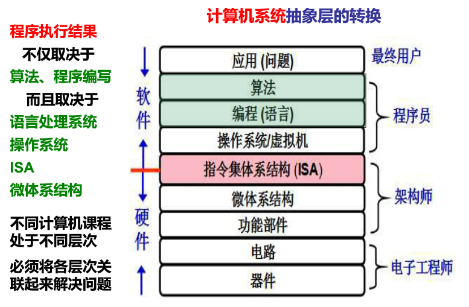

# EmbeddedSystem

这个仓库用来对嵌入式系统的基础知识和主流编程语言相关内容进行总结，每个目录对应一个大的方向。

# 主要内容

技术文档与学习记录：

- [Articles](Articles/)
- [Computer Vision](CV/)

嵌入式系统基础相关内容：

- [ARM](Arm/)
- [MCU](MCU/) 
- [Network](Network/)
- [Embedded Linux](Linux/)

编程语言相关内容：

- [C](C/)
- [C++](C++/)
- [Python](Python/)
- [JavaScript](JavaScript/)

环境搭建及工具：

- [Linux](Gist/Linux.md) 
- [Mac](Gist/Mac.md) 
- [Windows](Gist/Win.md) 
- [Git](Gist/Git.md) 
- [Docker](Gist/Docker.md) 
- [Tools](Tools/) 

理论基础：

- [Math](Math/)
- [DataStructure](DataStructure/)

# 说点什么

本仓库将会长期更新嵌入式领域相关的知识，一部分内容是作者的学习笔记和心得总结，一部分是日常工作中的常用技巧，还有通过各种方式收集的嵌入式知识。如果觉得有用，可以点亮小星星，也可以和作者一起完善它。

对于嵌入式软件工程师的定位最近我有了新的认知，嵌入式系统是一种比较复杂的计算机系统。

电子类专业的毕业生从机器级的层面开始学习，如单片机，微机原理，后来到语言层面，如 C 语言和 Python，然后学习数据结构和算法。这个路线看起来还不错，也适合来入门，但是这条路线里有很严重的问题，只是学习这些知识你会发现自己很难做到知其然而又知其所以然。

在嵌入式工作中遇到的问题往往是综合性的，也就是说仅仅从语言级别或者算法级别入手往往不能解决问题，有时候需要深入到机器级。那么问题来了，整个嵌入式系统到底分了哪些层级，或者说整个计算机系统有哪些层级？要对整个知识体系框架有所了解，知道自己的位置，你需要对计算机的组成原理有较为深入的了解。

在这里我推荐书籍是由 [Randal E. Bryant](http://www.cs.cmu.edu/~bryant) and [David R. O'Hallaron](http://www.cs.cmu.edu/~droh) 所著的《深入理解计算机系统》第三版。相应可以找到的课程是 MOOC 平台上的由袁春风教授讲授的 [《计算机系统基础》](https://www.icourse163.org/course/NJU-1001625001)课程，帮助我们建立对整个计算机系统抽象层的认识，增强我们解决嵌入式问题中的综合能力。

我认为想要成为一个更好的 developer 必须对日常使用的底层软件系统有更深入的了解，包括编程语言、编译器、解释器、数据库、操作系统、软件框架等。还有，想要对底层的系统有更深的了解，我觉得有必要从头开始，一砖一瓦地重建他们。

按照这种思路，我们可以根据教程自己动手写一个解释器或者编译器，也可以自己动手整理属于自己的知识体系，这里的重点是自己动手，自己构建，我认为这很重要。

孔子是这样说的：

- 吾听吾忘

  

- 吾见吾记

  

- 吾做吾悟

  
